# Global Data Flow Visualization
This document contains **Mermaid** diagrams illustrating the data flows within the system, focusing on **Products**, **Stores**, **Search-Service**, **Elasticsearch**, and their interactions with the database and API endpoints.

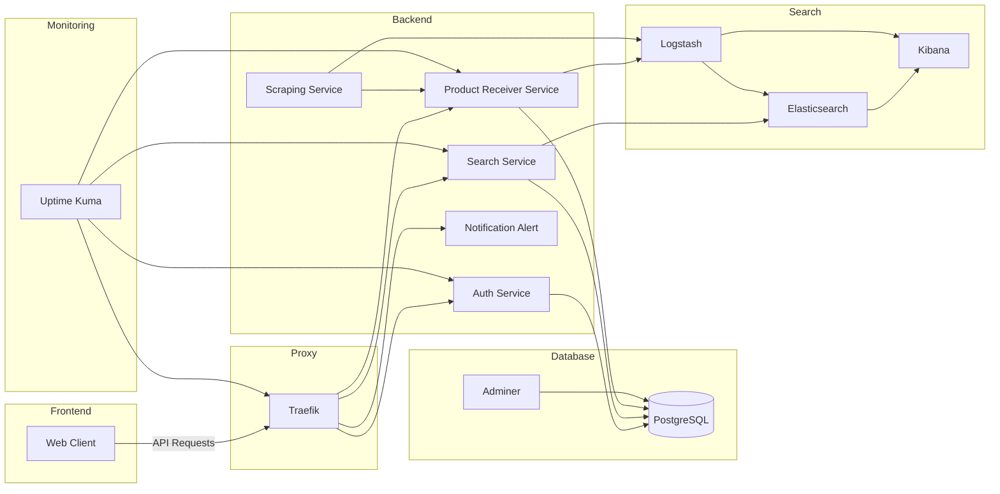

---

## 1. Database Schema Relationships

### Diagram

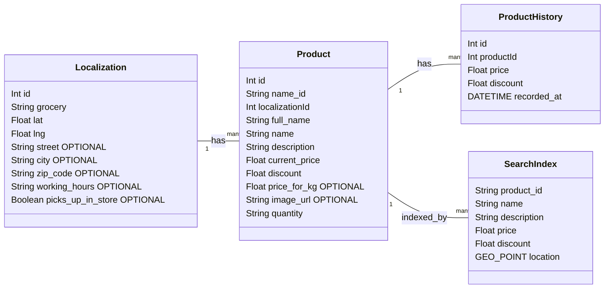

### Explanation

- **Entities**:
  - `Localization`: Represents stores or supermarkets with unique combinations of `grocery`, `lat`, `lng`, and `street`.
  - `Product`: Represents items sold in a specific store.
  - `ProductHistory`: Tracks changes in product prices and discounts over time.
  - `SearchIndex`: Represents the indexed data in Elasticsearch for efficient searching.

- **Relationships**:
  - `Localization "1" -- "many" Product : has`: Each store can have multiple products.
  - `Product "1" -- "many" ProductHistory : has`: Each product can have multiple history entries.
  - `Product "1" -- "many" SearchIndex : indexed_by`: Each product can have multiple search index entries.

---

## 2. API Data Flow: Product Creation/Update

### Diagram

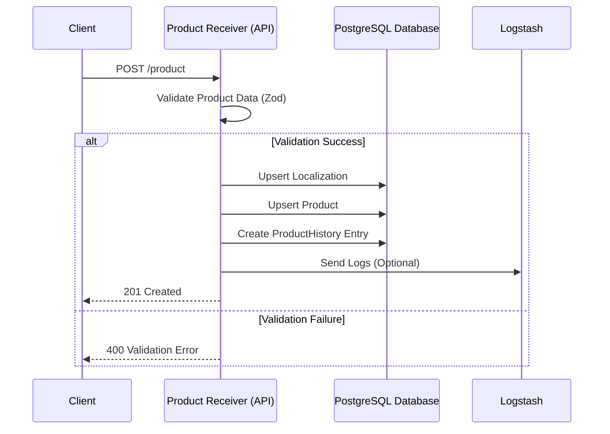

### Explanation

- **Flow**:
  - Client sends a `POST /product` request.
  - Data is validated using **Zod**.
  - On success:
    - `Localization` is upserted.
    - `Product` is upserted with a unique combination of `name_id` and `localizationId`.
    - A `ProductHistory` entry is created.
    - Logs are optionally sent to **Logstash**.
  - On failure, the client receives a validation error response.

---

## 3. API Data Flow: Store Creation/Update

### Diagram

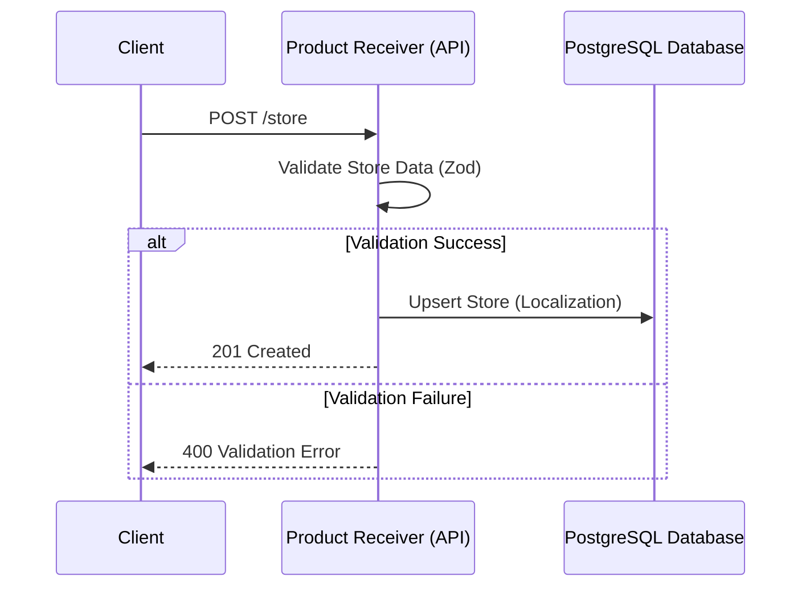

### Explanation

- **Flow**:
  - Client sends a `POST /store` request.
  - Store data is validated using **Zod**.
  - On success:
    - `Localization` (store) is upserted with a unique combination of `grocery`, `lat`, `lng`, and `street`.
  - On failure, the client receives a validation error.

---

## 4. Composite Unique Constraints

### Diagram

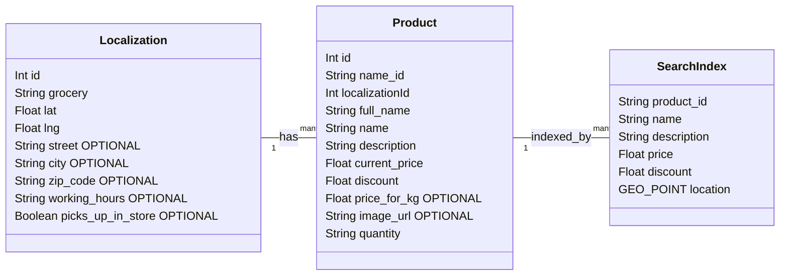

### Explanation

- **Localization**:
  - Unique constraint ensures no duplicate stores based on `grocery`, `lat`, `lng`, and `street`.

- **Product**:
  - Unique constraint ensures no duplicate products within the same store, based on `name_id` and `localizationId`.

- **SearchIndex**:
  - Unique constraint ensures each `product_id` is unique in the search index.

---

## 5. Search-Service Data Flow

### 5.1. Search Request Handling

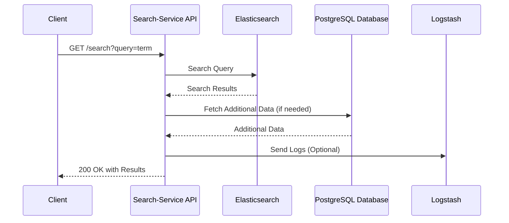

### 5.2. Product Existence Check

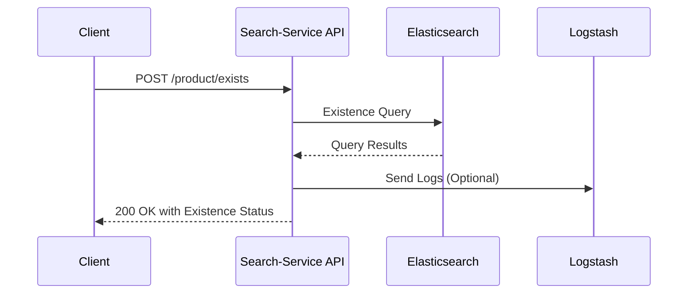

### 5.3. Lowest Price Calculation

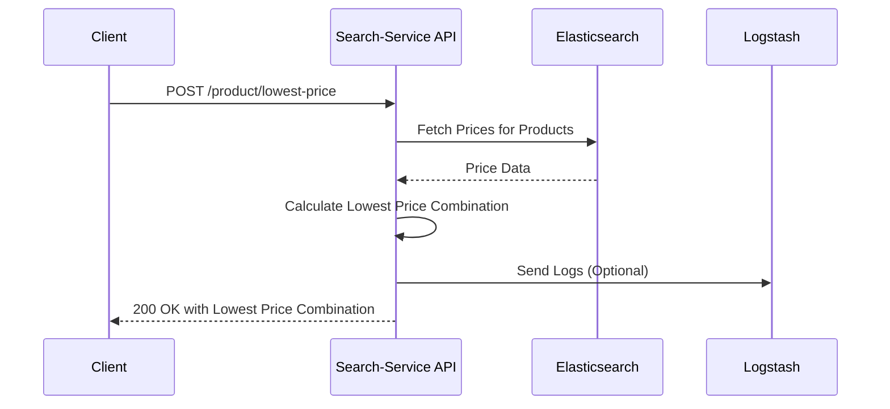

---

## 6. Elasticsearch Data Flow

### 6.1. Indexing Documents

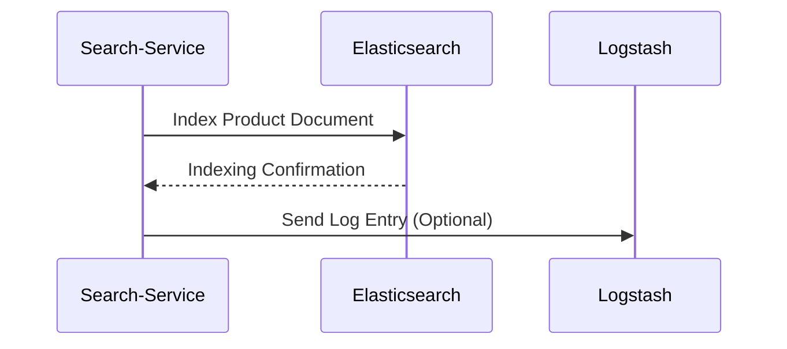

### 6.2. Handling Search Queries

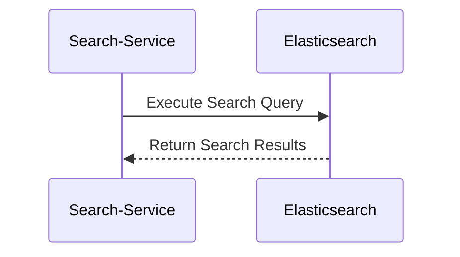

### 6.3. Integration with Logstash

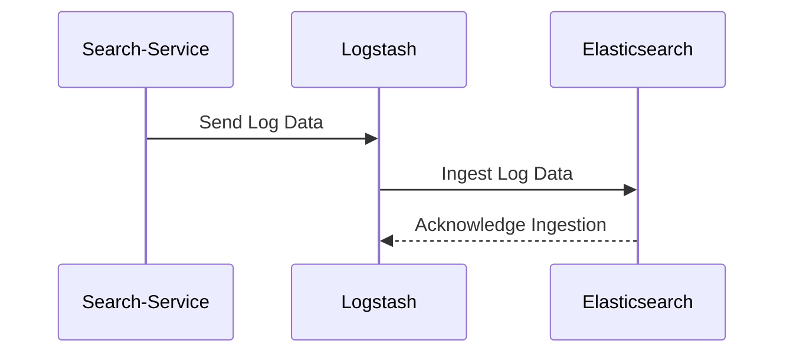

---

## 7. Logstash Data Flow

### 7.1. Log Ingestion and Processing

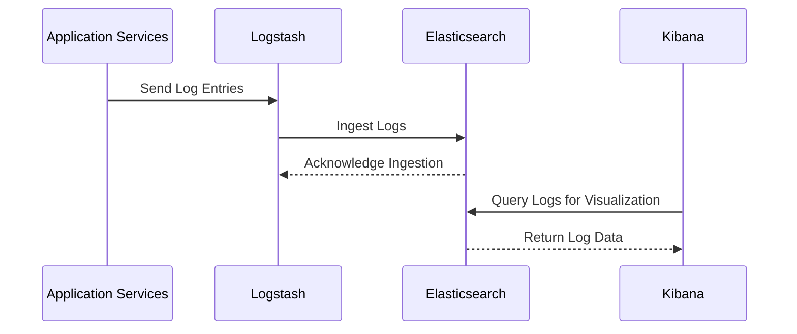

---

## 8. Elasticsearch Indexing and Search Workflow

### Diagram

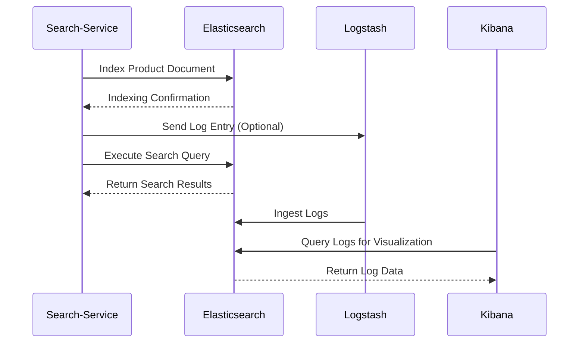

---

## 9. Logstash Processing Pipeline

### Diagram

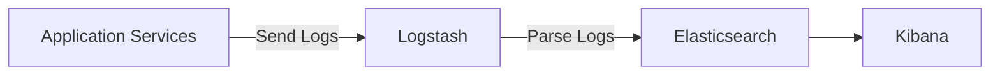

---

## 10. Global Data Flow

### Diagram

### Diagram Breakdown

- **Frontend**:
  - **Web Client**: The user interface that interacts with backend services via API requests.

- **Proxy**:
  - **Traefik**: Acts as a reverse proxy, routing incoming API requests to the appropriate backend services.

- **Backend Services**:
  - **Auth Service**: Handles authentication processes and communicates with the PostgreSQL database.
  - **Search Service**: Manages search functionalities, interacts with Elasticsearch, and fetches additional data from the PostgreSQL database.
  - **Product Receiver Service**: Receives and processes product data, interacts with the PostgreSQL database, and sends logs to Logstash.
  - **Notification Alert**: Handles notifications and alerts, routed through Traefik.
  - **Scraping Service**: Scrapes data from external sources, communicates with the Product Receiver Service, and sends logs to Logstash.

- **Database**:
  - **PostgreSQL**: Central database accessed by Auth Service, Search Service, and Product Receiver Service.
  - **Adminer**: Web-based database management tool for PostgreSQL.

- **Search Infrastructure**:
  - **Elasticsearch**: Search and analytics engine used by the Search Service.
  - **Logstash**: Log ingestion and processing pipeline, receives logs from various services and forwards them to Elasticsearch.
  - **Kibana**: Visualization tool for logs stored in Elasticsearch.

- **Monitoring**:
  - **Uptime Kuma**: Monitors the health and uptime of key services, including Traefik, Auth Service, Search Service, and Product Receiver Service.

- **Logging**:
  - **Logstash** sends processed logs to **Kibana** for visualization and analysis.
---

