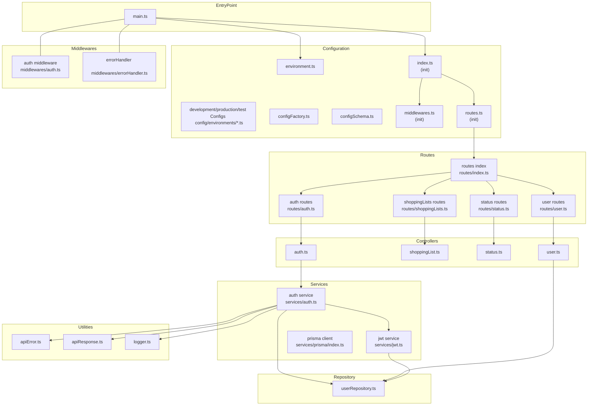

# Auth-Service Technical Documentation

## 1. Overview

The Auth-Service is responsible for user authentication and management. It implements secure login, registration, token refresh (using JWT), and user data management. Additionally, it includes endpoints for managing shopping lists and a health check endpoint to monitor service status.

## 2. Technologies & Tools

- **Language:** TypeScript
- **Runtime:** Node.js
- **ORM:** Prisma (database schema defined in `prisma/schema.prisma`)
- **Authentication:** JSON Web Token (JWT)
- **Containerization:** Docker (using Dockerfile and .dockerignore)
- **Configuration:** Environment variables (.env.example) and environment-specific config files

## 3. Project Structure

### 3.1 Root-Level Files

- **.dockerignore**  
  Excludes unnecessary files/directories from Docker builds.

- **.env.example**  
  Template for required environment variables (e.g., secret keys, database URL).

- **.gitignore**  
  Specifies files/folders to be ignored by Git.

- **Dockerfile**  
  Defines the steps to build the Docker image (base image, dependency installation, and startup command).

- **package.json & package-lock.json**  
  Manage dependencies, scripts, and project metadata.

- **tsconfig.json**  
  TypeScript configuration (compiler options, paths, etc.).

- **prisma/schema.prisma**  
  Defines the data models, relations, and configuration for Prisma ORM.

### 3.2 The `/src` Directory

#### 3.2.1 Entry Point

- **main.ts**  
  Initializes the server, loads configurations, sets up middleware, and registers routes.

#### 3.2.2 Configuration

- **config/environment.ts**  
  Loads and manages environment variables, centralizing service configuration.

- **config/environments/**  
  - `development.ts`, `production.ts`, `test.ts`  
    Contain environment-specific configurations such as database URLs, ports, and JWT secrets.

- **config/factories/configFactory.ts**  
  Dynamically generates configuration objects by combining environment variables with defaults and validation.

- **config/init/**  
  - **index.ts:**  
    Bootstraps the application by initializing middleware and routes.
  - **middlewares.ts:**  
    Registers global middleware (e.g., JSON parsing, CORS, logging).
  - **routes.ts:**  
    Aggregates and initializes all API routes.

- **config/schemas/configSchema.ts**  
  Defines the validation schema for configuration variables to ensure they meet required formats.

- **config/types/api.ts & custom.d.ts**  
  Provide TypeScript interfaces and type declarations for API structures and custom extensions.

#### 3.2.3 Controllers

- **controllers/auth.ts**  
  Handles authentication endpoints (login, registration, token refresh). Validates input and delegates to the authentication service.

- **controllers/shoppingList.ts**  
  Manages CRUD operations for shopping lists linked to users.

- **controllers/status.ts**  
  Exposes a health check endpoint to return service status details (e.g., uptime, version, database status).

- **controllers/user.ts**  
  Handles endpoints related to user data retrieval and updates.

#### 3.2.4 Middlewares

- **middlewares/auth.ts**  
  Protects routes by validating JWT tokens. Blocks access if the token is missing or invalid.

- **middlewares/errorHandler.ts**  
  Captures and processes errors, ensuring standardized error responses and proper logging.

#### 3.2.5 Repository

- **repositories/userRepository.ts**  
  Encapsulates all database operations for users. Uses Prisma to perform CRUD actions, abstracting data persistence from business logic.

#### 3.2.6 Routes

- **routes/auth.ts**  
  Defines endpoints for authentication (`/login`, `/register`, `/refresh`) and maps them to the auth controller.

- **routes/index.ts**  
  Aggregates all route definitions and registers them with the application.

- **routes/shoppingLists.ts**  
  Maps CRUD endpoints for shopping lists to the corresponding controller functions.

- **routes/status.ts**  
  Defines the health check endpoint.

- **routes/user.ts**  
  Maps user-related endpoints (e.g., GET and PUT for user profiles) to the user controller.

#### 3.2.7 Services

- **services/auth.ts**  
  Contains the core business logic for authentication:
  - **Password Hashing:** Securely hashes passwords before storing them.
  - **Credential Verification:** Compares provided credentials with stored values.
  - **Token Generation:** Coordinates with the JWT service to produce tokens upon successful authentication.

- **services/jwt.ts**  
  Handles all operations related to JSON Web Tokens:
  - Token creation, signing, decoding, and verification.

- **services/prisma/index.ts**  
  Initializes and configures the Prisma client, ensuring database connectivity and providing a central point for executing database queries.

#### 3.2.8 Utilities

- **utils/apiError.ts**  
  Defines custom error classes and helper functions to standardize API error responses.

- **utils/apiResponse.ts**  
  Provides utility functions to format successful API responses uniformly.

- **utils/logger.ts**  
  Implements logging functionality for debugging and monitoring, capturing significant events and errors.

## 4. API Endpoints and Request Flow

### 4.1 Authentication Endpoints

- **POST /auth/login**  
  **Purpose:** Authenticate an existing user.  
  **Flow:**  
  1. Controller receives login credentials (email/username and password).  
  2. Auth service validates credentials via userRepository.  
  3. On success, jwt.ts generates a JWT token returned along with user details.

- **POST /auth/register**  
  **Purpose:** Register a new user.  
  **Flow:**  
  1. Controller collects user details for registration.  
  2. Input validation and password hashing occur in the auth service.  
  3. A new user record is created in the database.  
  4. Optionally, a token is generated or confirmation is sent.

- **POST /auth/refresh**  
  **Purpose:** Refresh an expired JWT.  
  **Flow:**  
  1. Existing token is validated.  
  2. A new token is issued via the JWT service.

### 4.2 User Management Endpoints

- **GET /user/:id**  
  Retrieves detailed information for a specific user.

- **PUT /user/:id**  
  Updates user profile information. Access is controlled via JWT-based authentication.

### 4.3 Shopping Lists Endpoints

- **GET /shoppingLists**  
  Returns all shopping lists associated with the authenticated user.

- **POST /shoppingLists**  
  Creates a new shopping list for the user.

- **PUT /shoppingLists/:id**  
  Updates an existing shopping list.

- **DELETE /shoppingLists/:id**  
  Deletes a shopping list.

### 4.4 Health Check Endpoint

- **GET /status**  
  Provides a status check of the service, including uptime, version, and possibly database connectivity status.

## 5. Request Flow and Business Logic

1. **Incoming Request:**  
   HTTP requests are received at designated endpoints.

2. **Middleware Execution:**  
   Global middleware (e.g., JSON parser, JWT validation, error handling) process the request.

3. **Controller Handling:**  
   The appropriate controller handles the request, performs necessary validations, and delegates to the service layer.

4. **Service Execution:**  
   The service layer implements core business logic (authentication, password hashing, token management) and interacts with the repository for database operations.

5. **Database Operations:**  
   The repository (via Prisma) executes CRUD operations on the database.

6. **Response Generation:**  
   Responses are formatted uniformly using utility functions (apiResponse.ts) or error handlers (apiError.ts and errorHandler middleware) before being sent to the client.

---

