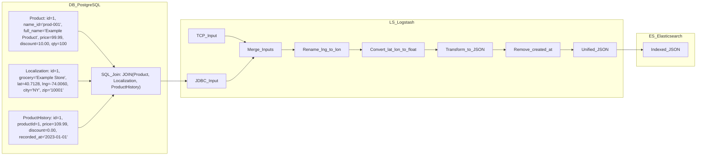

# Elasticsearch Technical Documentation

## 1. Overview
Elasticsearch is the central search engine powering the search capabilities in the liiist project. It indexes product and localization data so that fast, advanced full-text search queries can be executed. Data ingestion, transformation, and indexing are handled via Logstash, while the Search-Service (written in Rust) leverages Elasticsearch to perform fuzzy, multi-field queries. Kibana is used for monitoring, visualization, and debugging of the indexed data.

## 2. Technologies & Environment
- **Elasticsearch Version:** 8.15.3 (default, configurable via environment variable)
- **Docker Image:** `docker.elastic.co/elasticsearch/elasticsearch:${ELASTIC_VERSION:-8.15.3}`
- **Cluster Name:** `docker-cluster`
- **Security:** xpack security is disabled for local development
- **Networking:** Exposed on ports 9200 (HTTP) and 9300 (transport)
- **Configuration:** Driven by YAML files (e.g., `elasticsearch.yml`) and environment variables defined in `.env.example`

## 3. Configuration

### 3.1 Elasticsearch Configuration File (`config/elasticsearch.yml`)
Key settings include:
```yaml
cluster.name: docker-cluster
network.host: 0.0.0.0
xpack.security.enabled: false
```
- **Cluster Name:** Identifies the Elasticsearch cluster.
- **Network Host:** Binds Elasticsearch to all interfaces, making it accessible within the Docker network.
- **Security:** Disabled for local development, simplifying integration with other services.

### 3.2 Environment Variables
An example `.env.example` file in the Elasticsearch folder defines:
```sh
ELASTIC_VERSION=8.15.3
ELASTIC_PASSWORD=changeme
ELASTIC_URL=http://elasticsearch:9200
REMOTE_DATABASE_URL=postgresql://user:postgrespw@db:5432/appdb
LOGSTASH_INTERNAL_PASSWORD=changeme
```
These variables configure the Elasticsearch container and support interactions with Logstash and other services.

## 4. Data Ingestion and Indexing

### 4.1 Logstash Pipeline
Logstash ingests data from PostgreSQL and optionally via TCP, then outputs it to Elasticsearch.

#### Logstash Configuration (`pipeline/logstash.conf`)
```logstash
input {
  jdbc {
    jdbc_connection_string => "jdbc:postgresql://db:5432/appdb"
    jdbc_user => "${JDBC_USER}"
    jdbc_password => "${JDBC_PASSWORD}"
    jdbc_driver_library => "/usr/share/logstash/drivers/postgresql-42.5.4.jar"
    jdbc_driver_class => "org.postgresql.Driver"
    statement_filepath => "/usr/share/logstash/pipeline/sql_query.sql"
  }
  tcp {
    port => 50000
    codec => json_lines { target => "message" }
  }
}

filter {
  # Data transformation filters can be added here if needed.
}

output {
  elasticsearch {
    hosts => ["http://elasticsearch:9200"]
    index => "products-index"
    document_type => "_doc"
    user => "elastic"
    password => "${ELASTIC_PASSWORD}"
  }
}
```
- **Input (JDBC):** Executes a SQL query (see below) to fetch updated product data.
- **Input (TCP):** Listens for JSON-formatted messages.
- **Output:** Routes all incoming data into the `products-index` index in Elasticsearch.

#### SQL Query for Data Extraction (`pipeline/sql_query.sql`)
```sql
SELECT p.id, p.name, p.full_name, p.description, p.current_price, p.discount, p.quantity, 
       p.image_url, p.price_for_kg, p.created_at, p.updated_at, 
       l.grocery, l.lat, l.lng, l.street, l.city, l.zip_code, l.working_hours, l.picks_up_in_store 
FROM "Product" p 
JOIN "Localization" l ON p."localizationId" = l.id 
WHERE p."updated_at" > :sql_last_value
```
- **Purpose:** Extracts product details and localization information.
- **Mapping:** The resulting data defines the fields that will be indexed, enabling complex search queries.

## 5. Search-Service Integration
The Search-Service, implemented in Rust, interacts with Elasticsearch to execute search queries.

### 5.1 Key Components in Search-Service
- **Models:** Define the data structures (e.g., `ProductDB`, `StoreDB`) that represent the indexed documents.
- **Handlers:** Expose REST endpoints to accept search queries.
- **Search Logic:** Constructs Elasticsearch queries using fuzzy multi_match queries for enhanced relevancy.

#### Example Search Query (Rust)
```rust
use serde_json::json;

pub async fn fetch_most_similar(
    app_state: &Arc<AppState>,
    query: String,
) -> Result<SearchResponse, Box<dyn Error>> {
    let search_request = json!({
        "query": {
            "multi_match": {
                "query": query,
                "fields": ["full_name^3", "name^2", "description"],
                "fuzziness": "AUTO"
            }
        }
    });
    // Execute the search request using the Elasticsearch client
}
```
- **Fuzzy Multi-Match:** Searches across multiple fields with weighted importance.
- **Asynchronous Execution:** Leverages Tokio for concurrent processing.

## 6. Monitoring and Visualization via Kibana
Kibana provides a user-friendly interface to explore and visualize the indexed data.

### 6.1 Kibana Configuration (`config/kibana.yml`)
```yaml
server.name: kibana
server.host: 0.0.0.0
elasticsearch.hosts: [ "http://elasticsearch:9200" ]
```
- **Server Host:** Binds Kibana to all interfaces.
- **Elasticsearch Connection:** Points to the Elasticsearch service in the Docker network.
- **Usage:** Allows users to create dashboards, run queries, and monitor the search pipeline.

## 7. Containerization and Deployment

### 7.1 Elasticsearch Dockerfile
```dockerfile
ARG ELASTIC_VERSION
FROM docker.elastic.co/elasticsearch/elasticsearch:${ELASTIC_VERSION:-8.15.3}
```
- **Base Image:** Uses the official Elasticsearch image.
- **Custom Plugins:** Optionally, plugins can be installed during the build process.

### 7.2 Docker Compose Integration
The `docker-compose.yml` file defines the Elasticsearch service along with its dependencies:
```yaml
services:
  elasticsearch:
    build:
      context: elasticsearch/
      dockerfile: Dockerfile
      args:
        ELASTIC_VERSION: ${ELASTIC_VERSION}
    ports:
      - "9200:9200"
      - "9300:9300"
    environment:
      ELASTIC_PASSWORD: ${ELASTIC_PASSWORD}
    volumes:
      - elasticsearch:/usr/share/elasticsearch/data
```
- **Service Dependencies:** Elasticsearch is part of a shared Docker network and works with Logstash, Kibana, and Search-Service.
- **Data Persistence:** Data is stored in a Docker volume (`elasticsearch`).

## 8. Logical Data Flow Diagram
The following Mermaid diagram illustrates the high-level data flow between the systems:

```mermaid
flowchart TD
    A[PostgreSQL Database]
    B[Logstash Pipeline]
    C[Elasticsearch Index ("products-index")]
    D[Search-Service API (Rust)]
    E[Kibana Dashboard]

    A -->|SQL Query| B
    B -->|Data Ingestion| C
    D -->|Search Queries| C
    E -->|Data Visualization| C
```

## 9. Summary
- **Elasticsearch** is the core search engine that indexes product and localization data.
- **Logstash** ingests data from PostgreSQL using JDBC and feeds it into Elasticsearch.
- **Search-Service** uses advanced fuzzy search queries to retrieve relevant results from Elasticsearch.
- **Kibana** provides visualization and monitoring capabilities.
- The entire search stack is containerized using Docker Compose, ensuring seamless integration and deployment.

This documentation provides a technical overview of how Elasticsearch and its supporting services are configured, integrated, and deployed within the liiist project.



# Data Flow
DB_PostgreSQL:

>Product_Table: Contains product details (id, name_id, full_name, current_price, discount, quantity, etc.).
Localization_Table: Contains store/location information (grocery, lat, lng, city, zip, etc.).
ProductHistory_Table: Contains historical pricing data for the product.
SQL_Query: Represents the JOIN operation that combines data from Product, Localization, and ProductHistory.

LS_Logstash:
>JDBC_Input_from_DB: Data ingested from PostgreSQL using a JDBC connection.
TCP_Input_via_JSON_Lines: Additional data input (if any) via TCP in JSON format.
Merge Data from Inputs: Merges data from both JDBC and TCP inputs.
Rename "lng" to "lon": Renames the field to align with Elasticsearch geo_point requirements.
Convert lat & lon to Float: Ensures geographic coordinates are correctly formatted.
Ruby Transform: Uses a Ruby filter (or similar transformation) to create a combined "location" field.
Remove "created_at" Field: Removes unnecessary fields to optimize the final document.
Unified JSON Document: The final merged and transformed JSON document prepared for indexing.

ES_Elasticsearch:
> Final Indexed JSON Document: The unified document is then indexed in Elasticsearch, making it available for search queries.
This diagram clearly illustrates the entire lifecycle of a product—from being stored in PostgreSQL (including its history), processed by Logstash, and finally indexed in Elasticsearch.