# Kibana Technical Documentation

## 1. Overview
Kibana is a visualization and analytics platform designed to work with Elasticsearch. Here Kibana serves as the primary interface for monitoring, querying, and visualizing data indexed in Elasticsearch. Useful for debugging Logstash pipelines and creating dashboards that summarize key metrics and trends.

## 2. Purpose and Role
- **Visualization:** Create charts, maps, tables, and dashboards from Elasticsearch data.
- **Monitoring:** Track the health and performance of the Elasticsearch cluster and Logstash pipelines.
- **Querying:** Use the Dev Tools console for interactive Elasticsearch queries.
- **Dashboarding:** Combine visualizations into comprehensive dashboards for data analysis.

## 3. Key Features
- **Discover:** Explore and search through indexed data.
- **Visualize:** Build and customize visualizations.
- **Dashboard:** Assemble multiple visualizations into cohesive dashboards.
- **Dev Tools:** Interactively test and refine Elasticsearch queries.
- **Monitoring:** View cluster metrics and Logstash performance data.

## 4. Installation and Deployment

### 4.1 Docker Deployment
Kibana is deployed using the official Docker image and integrated into the liiist stack via Docker Compose.

**Sample Dockerfile:**
```dockerfile
ARG ELASTIC_VERSION
FROM docker.elastic.co/kibana/kibana:${ELASTIC_VERSION:-8.15.3}
# Optional: Install additional plugins here.
```

### 4.2 Environment Variables
Defined in the `.env.example` file:
```ini
KIBANA_PASSWORD=changeme
ELASTIC_SYSTEM_PASSWORD=changeme
```
These variables configure authentication (if enabled) and connection parameters with Elasticsearch.

### 4.3 Docker Compose Integration
A typical Docker Compose configuration for Kibana:
```yaml
services:
  kibana:
    build:
      context: ./kibana
      dockerfile: Dockerfile
      args:
        ELASTIC_VERSION: ${ELASTIC_VERSION}
    ports:
      - "5601:5601"
    environment:
      ELASTICSEARCH_HOSTS: "http://elasticsearch:9200"
      KIBANA_SYSTEM_PASSWORD: ${KIBANA_PASSWORD}
    depends_on:
      - elasticsearch
    networks:
      - shared-network
```
- **Port 5601:** Exposes Kibana’s web UI.
- **Dependencies:** Ensures Elasticsearch is available before starting Kibana.
- **Networking:** All services communicate over a shared Docker network.

## 5. Configuration

### 5.1 Kibana Configuration File (`config/kibana.yml`)
```yaml
server.name: kibana
server.host: 0.0.0.0
elasticsearch.hosts: [ "http://elasticsearch:9200" ]

monitoring.ui.container.elasticsearch.enabled: true
monitoring.ui.container.logstash.enabled: true

elasticsearch.username: kibana_system
elasticsearch.password: ${KIBANA_SYSTEM_PASSW}
```
- **Server Settings:** Kibana listens on all network interfaces.
- **Elasticsearch Connection:** Points to the Elasticsearch instance within the Docker network.
- **Monitoring:** Enables visualization of both Elasticsearch and Logstash metrics.
- **Security:** Credentials are configured but may not be enforced in local development.

## 6. Kibana's Role in the Stack
Kibana is a critical component of the liiist stack:
- **Visual Interface:** Provides a user-friendly UI for exploring and analyzing data stored in Elasticsearch.
- **Monitoring Dashboard:** Offers real-time insights into the health and performance of Elasticsearch and Logstash.
- **Query Debugging:** The Dev Tools console allows developers to test and optimize Elasticsearch queries.
- **Dashboard Creation:** Enables the assembly of custom dashboards that aggregate and display key system metrics and trends.

## 7. Logical Flow of Kibana with Other Services

```mermaid
flowchart
    %% Define Main Services
    subgraph Services
      PG[PostgreSQL]
      LS[Logstash]
      ES[Elasticsearch]
      KB[Kibana]
      SS[Search-Service]
    end

    %% Data Flow Connections
    PG -->|Extract Data| LS
    LS -->|Index Data| ES
    SS -->|Query Data| ES
    ES <--->|Visualize Data| KB
    LS <--->|Monitor Logs| KB

    %% Visual Style
    style PG fill:#333,stroke:#fff,stroke-width:2px
    style LS fill:#333,stroke:#fff,stroke-width:2px
    style ES fill:#333,stroke:#fff,stroke-width:2px
    style KB fill:#333,stroke:#fff,stroke-width:2px
    style SS fill:#333,stroke:#fff,stroke-width:2px

```



- **PostgreSQL:** Stores raw product data.
- **Logstash:** Extracts and transforms data from PostgreSQL, then indexes it in Elasticsearch.
- **Elasticsearch:** Acts as the search engine and data store.
- **Search-Service:** Queries Elasticsearch to serve search requests.
- **Kibana:** Retrieves data from Elasticsearch for visualization and monitors Logstash pipelines.

## 8. Usage Guidelines
- **Accessing Kibana:** Typically available at `http://localhost:5601` (adjust based on Docker configuration).
- **Navigation:** Use the top menu for Discover, Visualize, Dashboard, and Dev Tools.
- **Dashboard Creation:** Start by exploring data in Discover, build visualizations, and combine them in Dashboards.
- **Query Debugging:** Utilize the Dev Tools console to craft and refine Elasticsearch queries.

## 9. Security Considerations
- **Local Development:** Often uses self-signed certificates and relaxed security for ease of use.
- **Production Deployment:** Should enable ACME/Let's Encrypt for certificate management and enforce X-Pack security features.
- **Sensitive Data:** Environment variables (e.g., passwords) should be managed securely and not hard-coded.

## 10. Troubleshooting
- **Connectivity:** Ensure Kibana can reach Elasticsearch at the configured URL.
- **Performance:** Monitor Docker resources if the UI is slow; adjust resource limits if necessary.
- **Logs:** Use Kibana's built-in logging and monitoring features to diagnose issues with data ingestion or query performance.

## 11. Conclusion
Kibana providies an intuitive interface for data visualization, system monitoring, and debugging. Its seamless integration with Elasticsearch and Logstash enables efficient management of search data.

