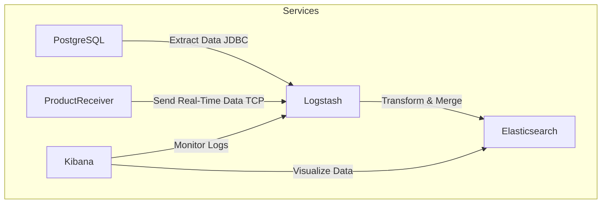

# Logstash Technical Documentation

## 1. Overview
Logstash is the data processing engine for the liiist project. It serves as the Extract, Transform, and Load (ETL) component that ingests data from PostgreSQL (and other sources), processes and transforms it, and then indexes the final documents into Elasticsearch. This enables advanced search capabilities and real-time analytics in the project.

## 2. Role in the Stack
- **Data Ingestion:** Logstash retrieves raw product and localization data from PostgreSQL using a JDBC connection and may also accept real-time data via TCP (e.g., from the Product Receiver Service).
- **Data Transformation:** It applies transformations such as field renaming, type conversion, and the creation of new composite fields (e.g., a geo-point field) to ensure compatibility with Elasticsearch mappings.
- **Data Indexing:** The processed data is then sent to Elasticsearch for indexing, making it searchable by the Search-Service and visible in Kibana.
- **Integration:** Logstash acts as the bridge between the database layer (PostgreSQL), the data consumer (Product Receiver Service), and the search engine (Elasticsearch).

## 3. Architecture and Pipeline Components

### 3.1. Input Stage
Logstash accepts data through two primary input plugins:
- **JDBC Input:**  
  Connects to PostgreSQL to execute a SQL query that joins the Product, Localization, and (optionally) ProductHistory tables.
  ```logstash
  input {
    jdbc {
      jdbc_connection_string => "jdbc:postgresql://db:5432/appdb"
      jdbc_user => "${JDBC_USER}"
      jdbc_password => "${JDBC_PASSWORD}"
      jdbc_driver_library => "/usr/share/logstash/drivers/postgresql-42.5.4.jar"
      jdbc_driver_class => "org.postgresql.Driver"
      statement_filepath => "/usr/share/logstash/pipeline/sql_query.sql"
    }
  }
  ```
- **TCP Input:**  
  Allows ingestion of JSON-formatted messages from external sources (such as the Product Receiver Service) over TCP.
  ```logstash
  input {
    tcp {
      port => 50000
      codec => json_lines { target => "message" }
    }
  }
  ```

### 3.2. Filter (Transformation) Stage
Data transformation ensures that the fields are properly formatted for Elasticsearch. Typical transformations include:
- **Field Renaming and Type Conversion:**  
  Rename the field `"lng"` to `"lon"` and convert both `"lat"` and `"lon"` to floats.
  ```logstash
  filter {
    mutate {
      rename => { "lng" => "lon" }
      convert => { "lat" => "float" }
      convert => { "lon" => "float" }
    }
  }
  ```
- **Geo-Point Creation:**  
  Use a Ruby filter (or similar) to create a new composite field named `"location"` that contains both latitude and longitude.
  ```logstash
  filter {
    ruby {
      code => '
        event.set("location", {
          "lat" => event.get("lat"),
          "lon" => event.get("lon")
        })
      '
    }
  }
  ```
- **Field Cleanup:**  
  Remove extraneous fields (e.g., `"created_at"`) that are not needed in the final indexed document.
  ```logstash
  filter {
    mutate {
      remove_field => ["created_at"]
    }
  }
  ```

### 3.3. Output Stage
The final, transformed document is indexed into Elasticsearch:
```logstash
output {
  elasticsearch {
    hosts => ["http://elasticsearch:9200"]
    index => "products-index"
    document_type => "_doc"
    user => "elastic"
    password => "${ELASTIC_PASSWORD}"
  }
}
```
- **Indexing:** Documents are stored in the `products-index`.
- **Authentication:** Basic credentials are provided (if required by Elasticsearch security settings).

## 4. Docker Integration

### 4.1. Dockerfile for Logstash
The Logstash Dockerfile ensures that the container is built with the correct version and has the necessary drivers:
```dockerfile
FROM docker.elastic.co/logstash/logstash:8.15.3

USER root

# Create directory for JDBC drivers and copy the PostgreSQL driver
RUN mkdir -p /usr/share/logstash/drivers
COPY drivers/postgresql-42.5.4.jar /usr/share/logstash/drivers/

# Set proper permissions for the driver
RUN chmod 644 /usr/share/logstash/drivers/postgresql-42.5.4.jar \
    && chown logstash:logstash /usr/share/logstash/drivers/postgresql-42.5.4.jar
```
- **Key Points:**  
  - Uses the official Logstash image (version 8.15.3).
  - Copies the PostgreSQL JDBC driver into the container.
  - Sets file permissions to ensure Logstash can access the driver.

### 4.2. Docker Compose Configuration
A typical Logstash service definition in Docker Compose integrates it with the rest of the stack:
```yaml
services:
  logstash:
    build:
      context: ./logstash
      dockerfile: Dockerfile
    volumes:
      - ./logstash/config/logstash.yml:/usr/share/logstash/config/logstash.yml:ro
      - ./logstash/pipeline/:/usr/share/logstash/pipeline/:ro
    depends_on:
      - db
      - elasticsearch
    networks:
      - shared-network
```
- **Volumes:** Mounts the Logstash configuration and pipeline files into the container.
- **Dependencies:** Waits for both the PostgreSQL database (`db`) and Elasticsearch to be healthy before starting.
- **Network:** Operates within a shared Docker network for inter-service communication.

## 5. Integration with the Product Receiver Service
The Product Receiver Service in the project uses environment variables to specify:
- **LOGSTASH_HOST:** Typically set to "logstash".
- **LOGSTASH_PORT:** Set to "50000".

This indicates that the Product Receiver Service can send data (via TCP with JSON lines) directly to Logstash. Logstash will then merge this real-time data with the data ingested via JDBC, ensuring that both batch and real-time data flows are handled seamlessly.

## 6. Logical Data Flow Diagram
Below is a Mermaid diagram illustrating the data flow through Logstash within the overall stack:


- **PostgreSQL:** Stores the raw product, localization, and product history data.
- **Product Receiver Service:** Sends additional data via TCP to Logstash.
- **Logstash:** Merges and transforms data from both JDBC and TCP inputs before indexing into Elasticsearch.
- **Elasticsearch:** Indexed data is made searchable.
- **Kibana:** Provides visualization and monitoring of the data.

## 7. Summary
- **Data Extraction:** Logstash retrieves data from PostgreSQL via a JDBC input and may also receive real-time JSON data via TCP.
- **Data Transformation:** It applies necessary transformations (renaming fields, converting types, creating geo-point fields, and cleaning up documents) to prepare the data for indexing.
- **Data Indexing:** Transformed data is output to Elasticsearch, where it is indexed for fast search and retrieval.
- **Docker Integration:** Logstash is containerized with an official Docker image, configured via Docker Compose, and integrated with the rest of the stack.
- **Product Receiver Integration:** The Product Receiver Service sends data directly to Logstash, ensuring both batch and real-time data flows are processed.

