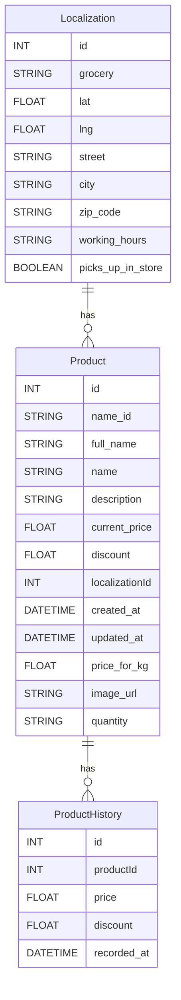
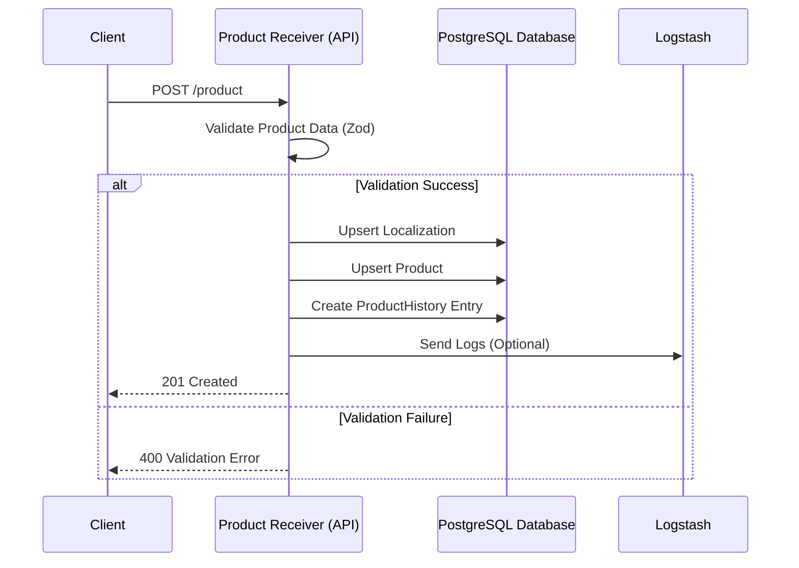
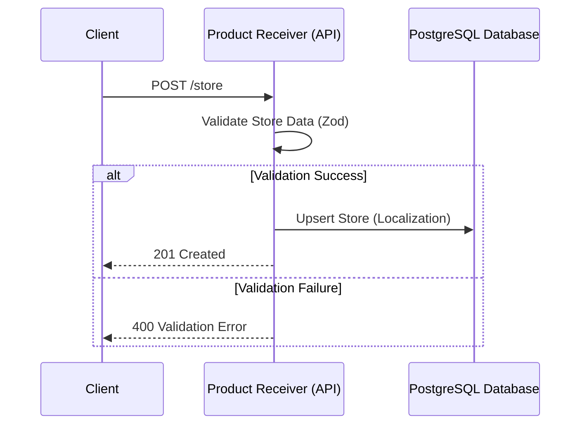
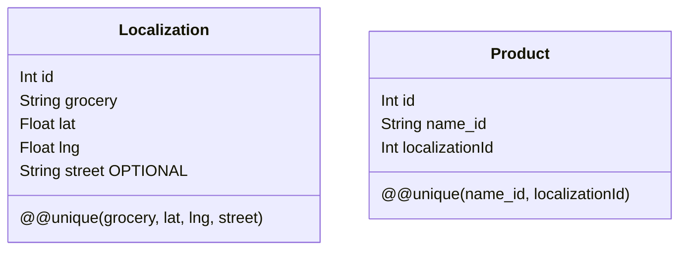

# # (Alert! Documentation Expired)  Data Flow Visualization

This document contains **Mermaid** diagrams illustrating the data flows within the system, focusing on **Products**, **Stores**, and their relationships with the database and API endpoints.
**(Alert! Documentation Expired)**  
The documentation is currently under revision and updates. Some sections may be incomplete or undergoing modifications.
---

## 1. Database Schema Relationships

### Diagram

### Explanation

- **Entities**:
  - `Product` represents an item sold in a specific location.
  - `ProductHistory` tracks changes in product prices and discounts over time.
  - `Localization` represents stores or supermarkets with unique combinations of `grocery`, `lat`, `lng`, and `street`.
- **Relationships**:
  - Each `Product` is associated with one `Localization`.
  - Each `Product` can have multiple `ProductHistory` entries.

---

## 2. API Data Flow: Product Creation/Update

### Diagram

### Explanation

- **Flow**:
  - Client sends a `POST /product` request.
  - Data is validated using **Zod**.
  - On success:
    - `Localization` is upserted.
    - `Product` is upserted with a unique combination of `name_id` and `localizationId`.
    - A `ProductHistory` entry is created.
    - Logs are optionally sent to Logstash.
  - On failure, the client receives a validation error response.

---

## 3. API Data Flow: Store Creation/Update

### Diagram

### Explanation

- **Flow**:
  - Client sends a `POST /store` request.
  - Store data is validated using **Zod**.
  - On success:
    - `Localization` (store) is upserted with a unique combination of `grocery`, `lat`, `lng`, and `street`.
  - On failure, the client receives a validation error.

---

## 4. Composite Unique Constraints

### Diagram

### Explanation

- **Localization**:
  - Unique constraint ensures no duplicate stores based on `grocery`, `lat`, `lng`, and `street`.
- **Product**:
  - Unique constraint ensures no duplicate products within the same store, based on `name_id` and `localizationId`.
