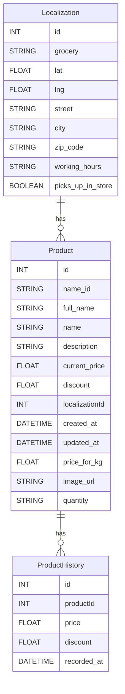
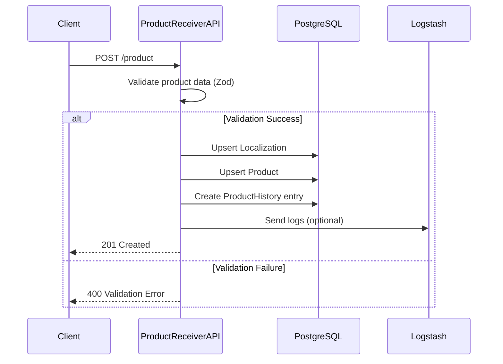
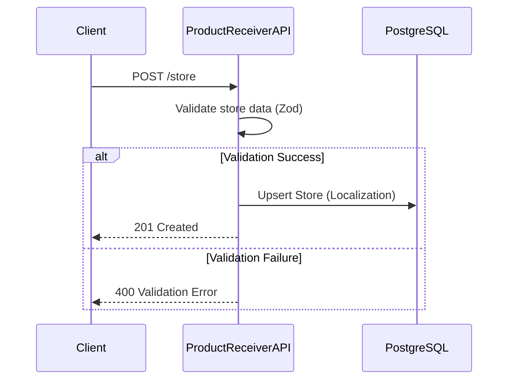
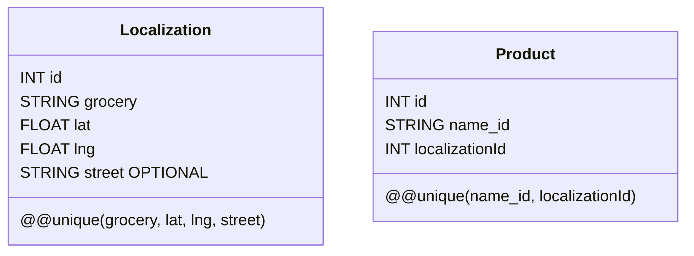

# Product Receiver Service Technical Documentation

_Last Updated: January 25, 2025_

---

## Table of Contents
- [Product Receiver Service Technical Documentation](#product-receiver-service-technical-documentation)
  - [Table of Contents](#table-of-contents)
  - [1. Introduction](#1-introduction)
  - [2. Architecture Overview](#2-architecture-overview)
  - [3. Environment Variables](#3-environment-variables)
  - [4. Data Models (Prisma Schema)](#4-data-models-prisma-schema)
  - [5. API Endpoints](#5-api-endpoints)
    - [Health Check Endpoint](#health-check-endpoint)
    - [Product Endpoint (Create/Update)](#product-endpoint-createupdate)
    - [Store Endpoint (Create/Update)](#store-endpoint-createupdate)
    - [Get All Stores](#get-all-stores)
    - [Get Stores by Grocery and City](#get-stores-by-grocery-and-city)
  - [6. Request Examples](#6-request-examples)
    - [cURL Examples](#curl-examples)
    - [Postman Examples](#postman-examples)
  - [7. Docker Integration](#7-docker-integration)
    - [7.1 Dockerfile Overview](#71-dockerfile-overview)
    - [7.2 Docker Compose Configuration](#72-docker-compose-configuration)
  - [8. Error Handling and Logging](#8-error-handling-and-logging)
  - [9. Future Enhancements](#9-future-enhancements)
  - [10. Additional: Data Flow Visualization](#10-additional-data-flow-visualization)
    - [10.1 Database Schema Relationships](#101-database-schema-relationships)
      - [Diagram](#diagram)
    - [Explanation](#explanation)
    - [10.2 API Data Flow: Product Creation/Update](#102-api-data-flow-product-creationupdate)
      - [Diagram](#diagram-1)
    - [Explanation](#explanation-1)
    - [10.3 API Data Flow: Store Creation/Update](#103-api-data-flow-store-creationupdate)
      - [Diagram](#diagram-2)
    - [Explanation](#explanation-2)
    - [10.4 Composite Unique Constraints](#104-composite-unique-constraints)
      - [Diagram](#diagram-3)
    - [Explanation](#explanation-3)

---

## 1. Introduction
The **Product Receiver Service** is a Node.js application built on Express.js that accepts, validates, and upserts product and store data into a PostgreSQL database using Prisma ORM. In addition, it forwards product data to Logstash for further processing (and eventual indexing into Elasticsearch). This service is a core component of the liiist project and is currently a work in progress with plans for further expansion.

---

## 2. Architecture Overview
The service performs the following functions:
- **Data Reception:** Receives HTTP POST requests containing product and store data.
- **Validation:** Uses the Zod library to validate incoming JSON payloads.
- **Upsert Operations:** Uses Prisma's upsert functionality to create or update records based on composite unique keys:
  - For **Product**: Uses `(name_id, localizationId)`.
  - For **Store** (represented by the Localization model): Uses `(grocery, lat, lng, street)`.
- **Logging:** On successful product upsert, sends product data to Logstash for further processing.
- **Exposure:** Provides endpoints for data insertion and retrieval, as well as a health-check.

A simplified data flow:
1. External clients send product/store data to the service.
2. The service validates and upserts data into PostgreSQL.
3. On success, product data is forwarded to Logstash.
4. Data can then be visualized and further processed downstream.

---

## 3. Environment Variables
A typical `.env` file for the service might include:
```bash
PRODUCT_RECEIVER_SERVICE_PORT=3002
REMOTE_DATABASE_URL=postgresql://user:postgrespw@db:5432/appdb
DATABASE_URL=postgres://user:postgrespw@db:5432/appdb
LOGSTASH_HOST=logstash
LOGSTASH_PORT=50000
JDBC_USER=user
JDBC_PASSWORD=postgrespw
```
- **PRODUCT_RECEIVER_SERVICE_PORT:** Port on which the service listens (default: 3002).
- **REMOTE_DATABASE_URL / DATABASE_URL:** Connection strings for PostgreSQL.
- **LOGSTASH_HOST / LOGSTASH_PORT:** Used for forwarding logs to Logstash.
- **JDBC_USER / JDBC_PASSWORD:** Credentials for connecting to the PostgreSQL database.

---

## 4. Data Models (Prisma Schema)
The service uses Prisma to manage its PostgreSQL data. Below is the current Prisma schema:

```prisma
generator client {
    provider = "prisma-client-js"
}

datasource db {
    provider = "postgresql"
    url      = env("REMOTE_DATABASE_URL")
}

model Product {
    id             Int              @id @default(autoincrement())
    name_id        String
    full_name      String
    name           String
    description    String
    current_price  Float
    discount       Float
    localizationId Int
    created_at     DateTime         @default(now())
    updated_at     DateTime         @updatedAt
    history        ProductHistory[]
    price_for_kg   Float?
    image_url      String?
    quantity       String?

    localization Localization @relation(fields: [localizationId], references: [id])

    @@unique([name_id, localizationId])
}

model ProductHistory {
    id          Int      @id @default(autoincrement())
    product     Product  @relation(fields: [productId], references: [id])
    productId   Int
    price       Float
    discount    Float
    recorded_at DateTime @default(now())
}

model Localization {
  id                Int       @id @default(autoincrement())
  grocery           String
  lat               Float
  lng               Float
  street            String
  city              String?
  zip_code          String?
  working_hours     String?
  picks_up_in_store Boolean?
  products          Product[]

  @@unique(name: "grocery_lat_lng_street", [grocery, lat, lng, street])
}
```
- **Product:** Uniquely identified by `(name_id, localizationId)`; stores current product details.
- **ProductHistory:** Captures historical price and discount data for each product.
- **Localization:** Represents store details and is uniquely identified by `(grocery, lat, lng, street)`.

---

## 5. API Endpoints

All endpoints are prefixed with `/api`.

### Health Check Endpoint
- **Method:** GET
- **URL:** `/api/health`
- **Description:** Checks if the service is running.
- **Response:**
  ```json
  { "status": "OK" }
  ```

### Product Endpoint (Create/Update)
- **Method:** POST
- **URL:** `/api/product`
- **Description:** Creates or updates a product. Uses Zod for validation; upsert is based on `(name_id, localizationId)`.
- **Request Body (JSON):**
  ```json
  {
    "full_name": "Banana Chiquita",
    "name": "Banana Chiquita",
    "description": "Fresh bananas",
    "price": 2.55,
    "discount": 1.2,
    "quantity": "1 bunch",
    "img_url": "https://example.com/banana.jpg",
    "price_for_kg": 2.50,
    "localization": {
      "grocery": "My Grocery",
      "lat": 12.34,
      "lng": 56.78,
      "street": "123 Main St"
    }
  }
  ```
- **Response (201 Created):**
  ```json
  {
    "message": "Product saved",
    "product": {
      "id": 1,
      "name_id": "banana_chiquita",
      "full_name": "Banana Chiquita",
      "name": "banana_chiquita",
      "description": "Fresh bananas",
      "current_price": 2.55,
      "discount": 1.2,
      "localizationId": 10,
      "created_at": "2025-01-01T12:00:00.000Z",
      "updated_at": "2025-01-01T12:00:00.000Z",
      "price_for_kg": 2.50,
      "image_url": "https://example.com/banana.jpg",
      "quantity": "1 bunch"
    },
    "action": "created"
  }
  ```
- **Validation:** Returns `400 Bad Request` with error details if validation fails.

### Store Endpoint (Create/Update)
- **Method:** POST
- **URL:** `/api/store`
- **Description:** Creates or updates a store (Localization). Uses a composite key `(grocery, lat, lng, street)`. If `street` is missing, it defaults to an empty string.
- **Request Body (JSON):**
  ```json
  {
    "name": "My Grocery",
    "lat": 12.34,
    "lng": 56.78,
    "street": "123 Main St",
    "city": "Sample City",
    "zip_code": "12345",
    "working_hours": "{\"mon\":\"8-20\"}",
    "picks_up_in_shop": true
  }
  ```
- **Response (201 Created):**
  ```json
  {
    "message": "Store saved",
    "store": {
      "id": 2,
      "grocery": "My Grocery",
      "lat": 12.34,
      "lng": 56.78,
      "street": "123 Main St",
      "city": "Sample City",
      "zip_code": "12345",
      "working_hours": "{\"mon\":\"8-20\"}",
      "picks_up_in_store": true
    },
    "action": "created"
  }
  ```

### Get All Stores
- **Method:** GET
- **URL:** `/api/store`
- **Description:** Retrieves all store records.
- **Response (200 OK):**
  ```json
  {
    "stores": [
      {
        "id": 2,
        "grocery": "My Grocery",
        "lat": 12.34,
        "lng": 56.78,
        "street": "123 Main St",
        "city": "Sample City",
        "zip_code": "12345",
        "working_hours": "{\"mon\":\"8-20\"}",
        "picks_up_in_store": true
      }
    ]
  }
  ```

### Get Stores by Grocery and City
- **Method:** GET
- **URL:** `/api/store/:grocery/:city`
- **Description:** Retrieves stores filtered by the specified grocery name and city.
- **Example Request:**  
  `GET /api/store/My%20Grocery/Sample%20City`
- **Response (200 OK):**
  ```json
  {
    "stores": [
      {
        "id": 2,
        "grocery": "My Grocery",
        "lat": 12.34,
        "lng": 56.78,
        "street": "123 Main St",
        "city": "Sample City",
        "zip_code": "12345",
        "working_hours": "{\"mon\":\"8-20\"}",
        "picks_up_in_store": true
      }
    ]
  }
  ```

---

## 6. Request Examples

### cURL Examples

- **Health Check:**
  ```bash
  curl -X GET http://localhost:3002/api/health
  ```

- **Create/Update Product:**
  ```bash
  curl -X POST http://localhost:3002/api/product \
    -H "Content-Type: application/json" \
    -d '{
      "full_name": "Banana Chiquita",
      "name": "Banana Chiquita",
      "description": "Fresh bananas",
      "price": 2.55,
      "discount": 1.2,
      "quantity": "1 bunch",
      "img_url": "https://example.com/banana.jpg",
      "price_for_kg": 2.50,
      "localization": {
        "grocery": "My Grocery",
        "lat": 12.34,
        "lng": 56.78,
        "street": "123 Main St"
      }
    }'
  ```

- **Create/Update Store:**
  ```bash
  curl -X POST http://localhost:3002/api/store \
    -H "Content-Type: application/json" \
    -d '{
      "name": "My Grocery",
      "lat": 12.34,
      "lng": 56.78,
      "street": "123 Main St",
      "city": "Sample City",
      "zip_code": "12345",
      "working_hours": "{\"mon\":\"8-20\"}",
      "picks_up_in_shop": true
    }'
  ```

- **Get All Stores:**
  ```bash
  curl -X GET http://localhost:3002/api/store
  ```

- **Get Stores by Grocery and City:**
  ```bash
  curl -X GET http://localhost:3002/api/store/My%20Grocery/Sample%20City
  ```

### Postman Examples

For each endpoint, create a new request in Postman:

1. **Health Check:**
   - Method: GET
   - URL: `http://localhost:3002/api/health`

2. **Product Endpoint:**
   - Method: POST
   - URL: `http://localhost:3002/api/product`
   - Body (raw JSON):
     ```json
     {
       "full_name": "Banana Chiquita",
       "name": "Banana Chiquita",
       "description": "Fresh bananas",
       "price": 2.55,
       "discount": 1.2,
       "quantity": "1 bunch",
       "img_url": "https://example.com/banana.jpg",
       "price_for_kg": 2.50,
       "localization": {
         "grocery": "My Grocery",
         "lat": 12.34,
         "lng": 56.78,
         "street": "123 Main St"
       }
     }
     ```

3. **Store Endpoint:**
   - Method: POST
   - URL: `http://localhost:3002/api/store`
   - Body (raw JSON):
     ```json
     {
       "name": "My Grocery",
       "lat": 12.34,
       "lng": 56.78,
       "street": "123 Main St",
       "city": "Sample City",
       "zip_code": "12345",
       "working_hours": "{\"mon\":\"8-20\"}",
       "picks_up_in_shop": true
     }
     ```

4. **Get All Stores:**
   - Method: GET
   - URL: `http://localhost:3002/api/store`

5. **Get Stores by Grocery and City:**
   - Method: GET
   - URL: `http://localhost:3002/api/store/My%20Grocery/Sample%20City`

---

## 7. Docker Integration

### 7.1 Dockerfile Overview
```dockerfile
FROM node:23

WORKDIR /app

COPY package*.json ./
RUN npm install && npm install typescript -g

COPY prisma ./prisma
RUN npx prisma generate

COPY . .
RUN tsc

EXPOSE 3002

CMD ["npm", "start"]
```
- **Base Image:** Node.js v23.
- **Dependency Installation:** Installs dependencies and TypeScript.
- **Prisma Client Generation:** Generates the Prisma client based on the schema.
- **Compilation:** Transpiles TypeScript code to JavaScript.
- **Port Exposure:** Listens on port 3002.
- **Execution:** Starts the service with `npm start`.

### 7.2 Docker Compose Configuration
```yaml
product-receiver-service:
  container_name: product-receiver-service
  build: 
    context: ./product-receiver-service
    dockerfile: Dockerfile
  depends_on:
    db: 
      condition: service_healthy
  ports:
    - "3002:3002"
  environment:
    PRODUCT_RECEIVER_SERVICE_PORT: ${PRODUCT_RECEIVER_SERVICE_PORT}
    REMOTE_DATABASE_URL: ${REMOTE_DATABASE_URL}
    DATABASE_URL: ${DATABASE_URL}
    LOGSTASH_HOST: logstash
    LOGSTASH_PORT: 50000
    JDBC_USER: ${JDBC_USER}
    JDBC_PASSWORD: ${JDBC_PASSWORD}
  volumes:
    - ./product-receiver-service:/app
    - product_receiver_data:/app/data
  networks:
    - shared-network
```
- **Dependencies:** Waits for the database to be healthy before starting.
- **Environment:** Configures connection strings and Logstash details.
- **Volume Mounts:** Mounts source code and persistent data.
- **Networking:** Uses a shared Docker network for inter-service communication.

---

## 8. Error Handling and Logging
- **Validation Errors:**  
  Handled by Zod; the service returns a `400 Bad Request` with a JSON body detailing validation issues.
- **Database Errors:**  
  Prisma upsert operations include retry logic for transient errors (e.g., `P2028`, `P2002`). If these errors persist, a `500 Internal Server Error` is returned.
- **Logstash Forwarding:**  
  After a successful product upsert, data is forwarded to Logstash via TCP. Any errors in this process are logged but do not prevent the main transaction from succeeding.
- **Console Logging:**  
  Detailed logging (info and error levels) is output to the console for monitoring and debugging.

---

## 9. Future Enhancements
- **Security Improvements:**  
  Implement authentication and authorization mechanisms for API endpoints.
- **Enhanced Logging:**  
  Integrate with centralized logging and monitoring tools.
- **API Expansion:**  
  Add endpoints for querying products and stores.
- **Scalability:**  
  Optimize retry logic and concurrency management for high-load scenarios.
- **Documentation Updates**  


>This documentation provides a detailed technical overview of its architecture, API endpoints, and Docker integration of the **Product Receiver Service**, serving as a reference for development, testing, and future enhancements. Currently It validates, upserts, and forwards product and store data to PostgreSQL and Logstash, enabling seamless integration with the search and analytics stack. 


## 10. Additional: Data Flow Visualization

This document contains Mermaid diagrams illustrating the data flows within the system, focusing on Products, Stores, and their relationships with the database and API endpoints.

---

### 10.1 Database Schema Relationships

#### Diagram



### Explanation

- **Entities:**
  - **Product:** Represents an item sold in a specific location.
  - **ProductHistory:** Tracks changes in product prices and discounts over time.
  - **Localization:** Represents stores or supermarkets uniquely identified by the combination of `grocery`, `lat`, `lng`, and `street`.
- **Relationships:**
  - Each **Product** is associated with one **Localization**.
  - Each **Product** can have multiple **ProductHistory** entries.

---

### 10.2 API Data Flow: Product Creation/Update

#### Diagram



### Explanation

- **Flow:**
  - The client sends a `POST /product` request.
  - The API validates the product data using **Zod**.
  - On success:
    - The service upserts the **Localization** record.
    - Then upserts the **Product** using a composite key `(name_id, localizationId)`.
    - A new **ProductHistory** entry is created.
    - Optionally, product data is forwarded to Logstash.
  - On failure, a validation error is returned.

---

### 10.3 API Data Flow: Store Creation/Update

#### Diagram



### Explanation

- **Flow:**
  - The client sends a `POST /store` request.
  - The store data is validated using **Zod**.
  - On success, the **Localization** record is upserted using the composite key `(grocery, lat, lng, street)`.
  - On failure, a validation error is returned.

---

### 10.4 Composite Unique Constraints

#### Diagram



### Explanation

- **Localization:**  
  The unique constraint ensures that no two stores with the same combination of `grocery`, `lat`, `lng`, and `street` exist.
- **Product:**  
  The unique constraint ensures that products within the same store (identified by `localizationId`) are unique based on `name_id`.
