Below are the **Mermaid** diagrams illustrating the data flows for the **search-service**, **Elasticsearch**, and **Logstash**. 
---

## 1. Database Schema Relationships

### Diagram

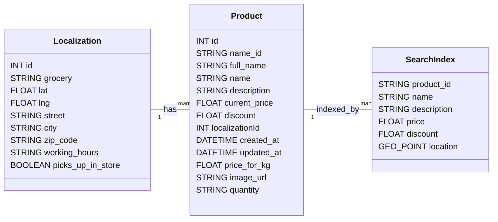

---

## 2. Search-Service Data Flow

### 2.1. Search Request Handling

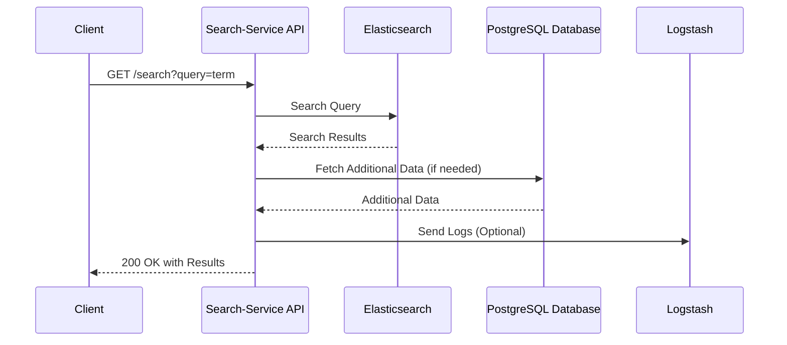

### 2.2. Product Existence Check

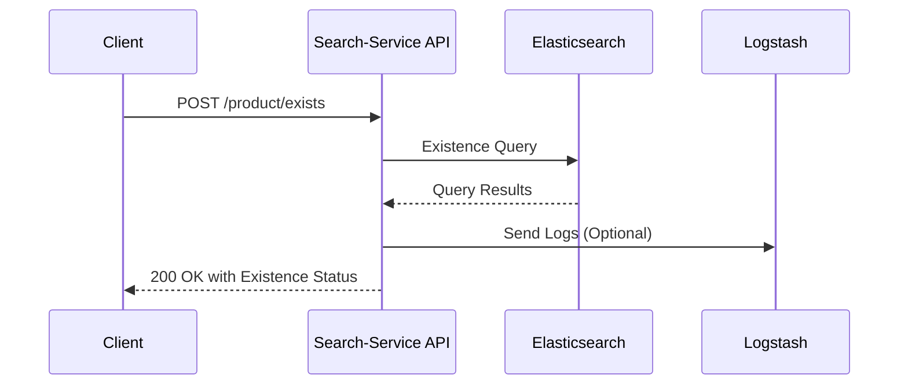

### 2.3. Lowest Price Calculation

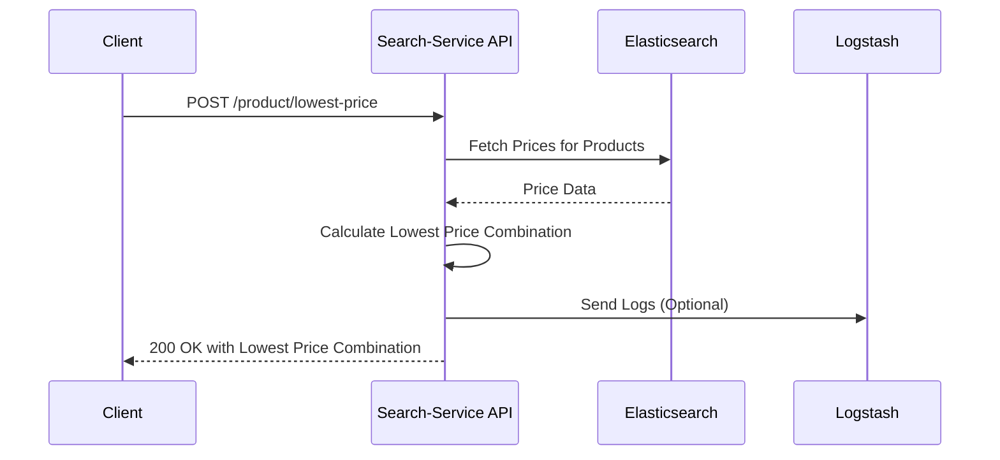

---

## 3. Elasticsearch Data Flow

### 3.1. Indexing Documents

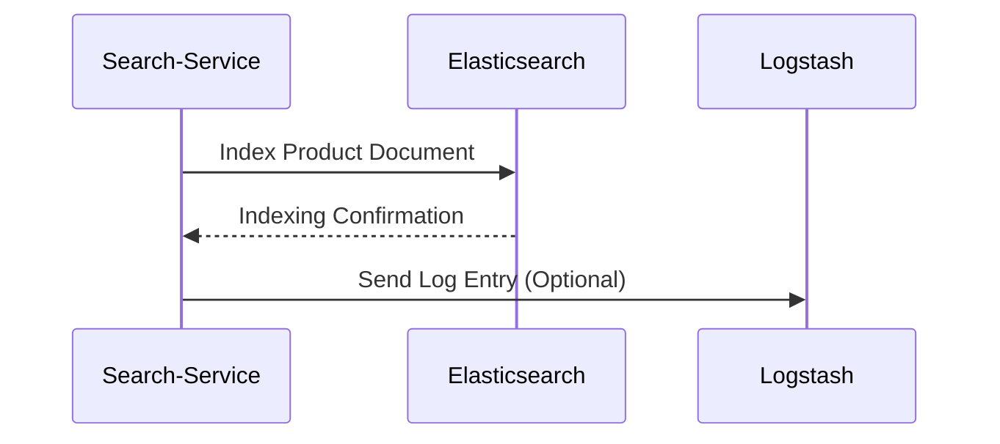

### 3.2. Handling Search Queries

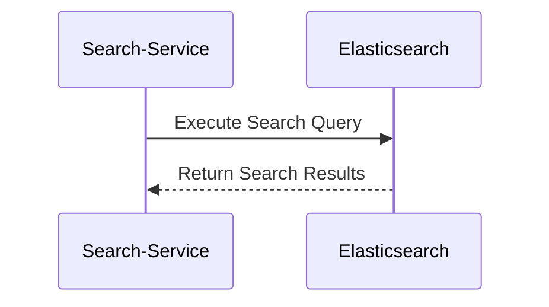

### 3.3. Integration with Logstash

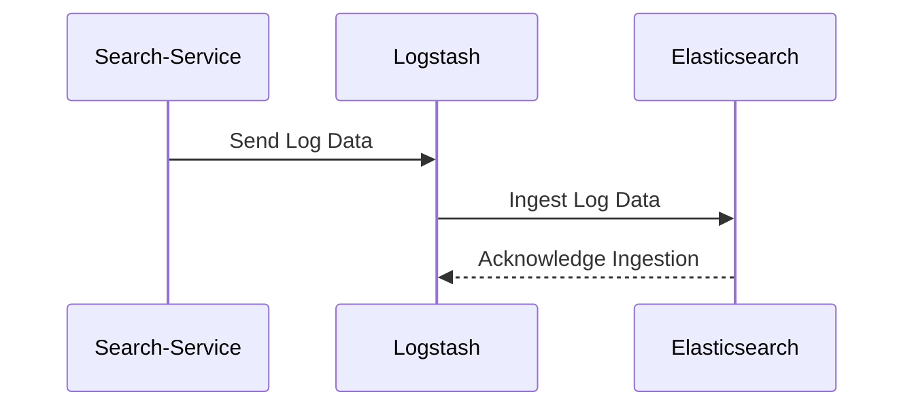

---

## 4. Logstash Data Flow

### 4.1. Log Ingestion and Processing

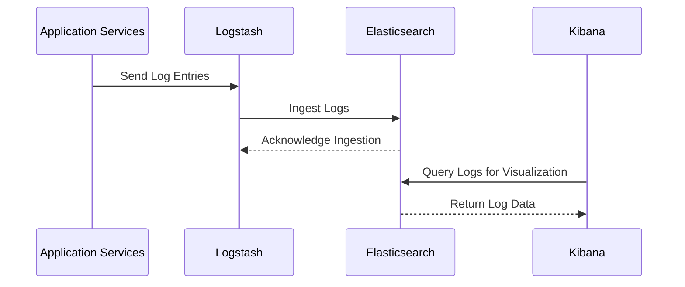

---

## 5. Composite Unique Constraints

### Diagram

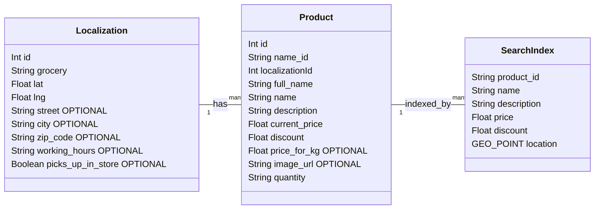

---

## 6. Elasticsearch Indexing and Search Workflow

### Diagram

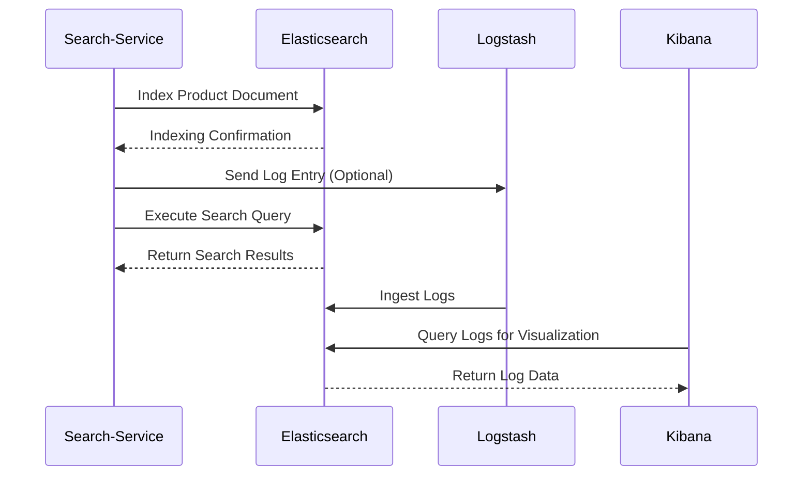

---

## 7. Logstash Processing Pipeline

### Diagram

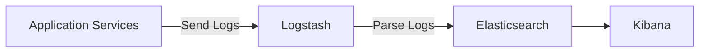

---