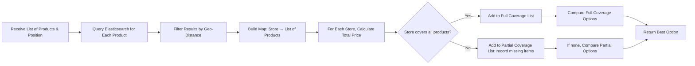

# Search Service Technical Documentation

_Last Updated: January 25, 2025_

---

## Table of Contents
- [Search Service Technical Documentation](#search-service-technical-documentation)
  - [Table of Contents](#table-of-contents)
  - [1. Introduction](#1-introduction)
  - [2. Architecture Overview](#2-architecture-overview)
  - [3. Environment and Dependencies](#3-environment-and-dependencies)
    - [Environment Variables](#environment-variables)
    - [Cargo Dependencies (Cargo.toml)](#cargo-dependencies-cargotoml)
  - [4. Data Models](#4-data-models)
  - [5. API Endpoints](#5-api-endpoints)
    - [GET /search](#get-search)
      - [cURL Example:](#curl-example)
    - [POST /product/exists](#post-productexists)
      - [cURL Example:](#curl-example-1)
    - [POST /product/in-shop](#post-productin-shop)
      - [cURL Example:](#curl-example-2)
    - [POST /product/lowest-price](#post-productlowest-price)
      - [cURL Example:](#curl-example-3)
    - [GET /stores](#get-stores)
      - [cURL Example:](#curl-example-4)
    - [GET /store/:id/products](#get-storeidproducts)
      - [cURL Example:](#curl-example-5)
  - [6. Search Algorithms and Query Construction](#6-search-algorithms-and-query-construction)
    - [Fuzzy Search and Multi-Match Query](#fuzzy-search-and-multi-match-query)
    - [Geo-Distance Filtering](#geo-distance-filtering)
    - [Lowest Price Retrieval Modes](#lowest-price-retrieval-modes)
    - [Utility Functions](#utility-functions)
  - [7. Docker Integration](#7-docker-integration)
    - [Dockerfile](#dockerfile)
    - [Docker Compose](#docker-compose)
  - [8. API Testing Examples](#8-api-testing-examples)
    - [cURL Examples](#curl-examples)
    - [Postman Examples](#postman-examples)
  - [9. Conclusion](#9-conclusion)

---

## 1. Introduction
The **Search Service** is a Rust-based microservice built with Axum that provides advanced product search capabilities for the open-liiist project. It leverages Elasticsearch for full-text, fuzzy, and geo-based search queries and PostgreSQL for store (localization) data. This document explains the service's endpoints, search algorithms, integration with Elasticsearch and Logstash, and how to test its API.

---

## 2. Architecture Overview
- **Web Framework:** Axum handles HTTP requests.
- **Async Runtime:** Tokio is used for asynchronous operations.
- **Search Engine:** Elasticsearch powers the full-text and geo-based searches.
- **Database:** PostgreSQL stores store data (Localization) accessed via SQLx.
- **State Management:** Shared state holds the Elasticsearch client (guarded by a Mutex) and the PostgreSQL connection pool.
- **Logging:** Structured logging is implemented via the tracing crate.
- **Search Algorithms:** Implements fuzzy search, geo-distance filtering, and lowest-price queries.

A simplified flow:
1. Client submits a search query.
2. The service queries Elasticsearch (and PostgreSQL for store info).
3. Results are processed (e.g., ranking, price aggregation).
4. Final results are returned to the client.

---

## 3. Environment and Dependencies

### Environment Variables
A sample `.env` file for the search service:
```bash
SEARCH_SERVICE_PORT=4001
DATABASE_URL=postgresql://user:postgrespw@db:5432/appdb
REMOTE_DATABASE_URL=postgresql://user:postgrespw@db:5432/appdb
ELASTICSEARCH_URL=http://elasticsearch:9200
RUST_LOG=search_service=debug
```

### Cargo Dependencies (Cargo.toml)
Key dependencies include:
- **axum** and **axum-macros** – For building the API.
- **elasticsearch** – Rust client for Elasticsearch.
- **reqwest** – For asynchronous HTTP requests.
- **serde** and **serde_json** – For JSON serialization/deserialization.
- **tokio** – Asynchronous runtime.
- **tower-http** – HTTP middleware.
- **tracing** and **tracing-subscriber** – For structured logging.
- **hyper** – For HTTP support.
- **sqlx** – For asynchronous PostgreSQL interactions.
- **aide** – (Optional) For API documentation generation.

---

## 4. Data Models
Defined in `src/models.rs`, the key structures include:

- **StoreDB:** Represents store data from PostgreSQL.
- **ProductDB:** Represents product records from PostgreSQL.
- **SearchQuery:** Query parameters for search, including the search term and user's position.
- **ProductResult:** Represents a product returned from Elasticsearch; contains fields like `_id`, `name`, `full_name`, `description`, `price`, `discount`, and a nested `Localization`.
- **Localization:** Contains store details (grocery, lat, lon).
- **SearchResponse:** Final response containing two arrays: `most_similar` and `lowest_price`.
- **Additional structures:** Such as `ProductExistRequest/Response`, `ProductInShopRequest/Response`, `ProductsLowestPriceRequest`, `LowestPriceResponse`, `ShopProduct`, and `LowestPriceExtended` used for specialized queries.

---

## 5. API Endpoints

All endpoints are prefixed by the base URL (configured in `main.rs`).

### GET /search
**Description:**  
Performs a fuzzy search for products using the query string and user’s geographic position.

**Query Parameters:**
- `query` (string): The search term.
- `position_latitude` (float): User's latitude.
- `position_longitude` (float): User's longitude.

**Response:**  
Returns a JSON object with two arrays:
- `most_similar`: Products matching the query.
- `lowest_price`: Products from stores offering the lowest price.

#### cURL Example:
```bash
curl -X GET "http://localhost:4001/search?query=mozzarella&position_latitude=45.472&position_longitude=9.2"
```

---

### POST /product/exists
**Description:**  
Checks if a specified product exists near a given location.

**Request Body (JSON):**
```json
{
  "product": "pasta_barilla_spaghetti_500g",
  "position": {
    "latitude": 45.4642,
    "longitude": 9.19
  }
}
```

**Response Example:**
```json
{
  "product": "pasta_barilla_spaghetti_500g",
  "exists": true,
  "details": {
    "_id": "1",
    "name": "pasta_barilla_spaghetti_500g",
    "full_name": "Pasta Barilla Spaghetti 500g",
    "description": "Spaghetti Barilla 500g",
    "price": 1.2,
    "discount": 0.0,
    "localization": {
      "grocery": "Carrefour Milano",
      "lat": 45.4642,
      "lon": 9.19
    },
    "distance": 0.0
  }
}
```

#### cURL Example:
```bash
curl -X POST "http://localhost:4001/product/exists" \
  -H "Content-Type: application/json" \
  -d '{
    "product": "pasta_barilla_spaghetti_500g",
    "position": {
      "latitude": 45.4642,
      "longitude": 9.19
    }
  }'
```

---

### POST /product/in-shop
**Description:**  
Checks if a product is available in a specific shop.

**Request Body (JSON):**
```json
{
  "product": "milk_1l",
  "shop": "Conad Milano",
  "position": {
    "latitude": 45.465,
    "longitude": 9.22
  }
}
```

**Response Example:**
```json
{
  "product": "milk_1l",
  "shop": "Conad Milano",
  "exists": true,
  "details": {
    "_id": "3",
    "name": "milk_1l",
    "full_name": "Latte Intero 1L",
    "description": "Latte fresco intero",
    "price": 1.0,
    "discount": 0.0,
    "localization": {
      "grocery": "Conad Milano",
      "lat": 45.465,
      "lon": 9.22
    },
    "distance": 0.0
  }
}
```

#### cURL Example:
```bash
curl -X POST "http://localhost:4001/product/in-shop" \
  -H "Content-Type: application/json" \
  -d '{
    "product": "milk_1l",
    "shop": "Conad Milano",
    "position": {
      "latitude": 45.465,
      "longitude": 9.22
    }
  }'
```

---

### POST /product/lowest-price
**Description:**

Retrieves the best price combination for a list of products.
Supports modes such as `"convenience"` and `"savings"` (Work In Progress, not be fully implemented ).
> Note: "savings" mode `risparmio` and "convenience" mode `comodita`.

**Request Body (JSON):**
```json
{
  "products": [
    "pane_integrale_500g",
    "formaggio_grana_padano_1kg",
    "latte_parzialmente_scremato_1l"
  ],
  "position": {
    "latitude": 45.4642,
    "longitude": 9.19
  },
  "mode": "savings"
}
```

**Response Example:**
```json
[
  {
    "shop": "Carrefour Milano + Esselunga Milano",
    "total_price": 15.6,
    "products": [
      {
        "shop": "Carrefour Milano",
        "name": "pane_integrale_500g",
        "description": "Pane fresco integrale",
        "price": 2.5,
        "discount": 0.0,
        "distance": 0.0
      },
      {
        "shop": "Esselunga Milano",
        "name": "formaggio_grana_padano_1kg",
        "description": "Formaggio stagionato Grana Padano",
        "price": 12.0,
        "discount": 2.0,
        "distance": 0.0
      },
      {
        "shop": "Conad Milano",
        "name": "latte_parzialmente_scremato_1l",
        "description": "Latte fresco parzialmente scremato",
        "price": 1.1,
        "discount": 0.1,
        "distance": 0.0
      }
    ]
  }
]
```

#### cURL Example:
```bash
curl -X POST "http://localhost:4001/product/lowest-price" \
  -H "Content-Type: application/json" \
  -d '{
    "products": [
      "pane_integrale_500g",
      "formaggio_grana_padano_1kg",
      "latte_parzialmente_scremato_1l"
    ],
    "position": {
      "latitude": 45.4642,
      "longitude": 9.19
    },
    "mode": "savings"
  }'
```

---

### GET /stores
**Description:**  
Retrieves all store records from PostgreSQL.

#### cURL Example:
```bash
curl -X GET "http://localhost:4001/stores"
```

---

### GET /store/:id/products
**Description:**  
Retrieves all products available in the store with the specified ID.

#### cURL Example:
```bash
curl -X GET "http://localhost:4001/store/2/products"
```

---

## 6. Search Algorithms and Query Construction

### Fuzzy Search and Multi-Match Query
The search service uses a **multi_match query** for fuzzy searching, combining different fields for better relevance. For example, the query used in `fetch_most_similar`:
```json
{
  "query": {
    "multi_match": {
      "fields": ["full_name", "name", "name.keyword", "description"],
      "query": "mozzarella",
      "type": "best_fields",
      "fuzziness": "AUTO"
    }
  },
  "size": 10,
  "_source": ["full_name", "name", "description", "current_price", "discount", "grocery", "lat", "lon"]
}
```
- **Fuzziness ("AUTO")**: Automatically adjusts the allowed edit distance based on the length of the query.
- **Fields:** Multiple fields are queried to capture different aspects of the product.

### Geo-Distance Filtering
For location-based queries, a **geo_distance filter** is applied:
```json
"filter": {
  "geo_distance": {
    "distance": "200km",
    "location": {
      "lat": 45.4642,
      "lon": 9.19
    }
  }
}
```
- This ensures that only products within the specified radius are considered.

### Lowest Price Retrieval Modes
The service supports different modes for retrieving the lowest price:
- **Savings Mode ("savings"):**  
  Finds a single store or combination of stores that cover all requested products with the lowest total price.
- **Convenience Mode ("convenience"):**  
  Finds a single store covering all required products, prioritizing ease over cost.
  
A visual flow for the lowest price algorithm is provided below:



### Utility Functions
- **Haversine Distance:**  
  Calculates the distance between two coordinates to rank products by proximity.
- **Sanitize:**  
  Normalizes strings for consistent matching (e.g., lowercasing, removing special characters).

---

## 7. Docker Integration

### Dockerfile
```dockerfile
FROM rust:1.81

WORKDIR /app

COPY Cargo.toml .
COPY src ./src

RUN cargo build --release

EXPOSE 4001

CMD ["sh", "-c", "echo REMOTE_DATABASE_URL=$REMOTE_DATABASE_URL && ./target/release/search-service"]
```
- Builds the application in release mode.
- Exposes port 4001.

### Docker Compose
```yaml
search-service:
  build: 
    context: ./search-service
    dockerfile: Dockerfile
  ports:
    - "4001:4001"
  environment:
    - SEARCH_SERVICE_PORT=${SEARCH_SERVICE_PORT}
    - ELASTICSEARCH_URL=http://elasticsearch:9200
    - REMOTE_DATABASE_URL=${REMOTE_DATABASE_URL}
    - RUST_LOG=debug
  networks:
    - shared-network
```
- Integrates with Elasticsearch and PostgreSQL.
- Uses environment variables for configuration.
- Runs on the shared Docker network.

---

## 8. API Testing Examples

### cURL Examples

- **Search Endpoint:**
  ```bash
  curl -X GET "http://localhost:4001/search?query=mozzarella&position_latitude=45.472&position_longitude=9.2"
  ```

- **Product Exists:**
  ```bash
  curl -X POST "http://localhost:4001/product/exists" \
       -H "Content-Type: application/json" \
       -d '{
             "product": "pasta_barilla_spaghetti_500g",
             "position": {
               "latitude": 45.4642,
               "longitude": 9.19
             }
           }'
  ```

- **Product in Shop:**
  ```bash
  curl -X POST "http://localhost:4001/product/in-shop" \
       -H "Content-Type: application/json" \
       -d '{
             "product": "milk_1l",
             "shop": "Conad Milano",
             "position": {
               "latitude": 45.465,
               "longitude": 9.22
             }
           }'
  ```

- **Lowest Price (Savings Mode):**
  ```bash
  curl -X POST "http://localhost:4001/product/lowest-price" \
       -H "Content-Type: application/json" \
       -d '{
             "products": [
               "pane_integrale_500g",
               "formaggio_grana_padano_1kg",
               "latte_parzialmente_scremato_1l"
             ],
             "position": {
               "latitude": 45.4642,
               "longitude": 9.19
             },
             "mode": "savings"
           }'
  ```

- **Lowest Price (Convenience Mode):**
  ```bash
  curl -X POST "http://localhost:4001/product/lowest-price" \
       -H "Content-Type: application/json" \
       -d '{
             "products": [
               "pane_integrale_500g",
               "formaggio_grana_padano_1kg",
               "latte_parzialmente_scremato_1l"
             ],
             "position": {
               "latitude": 45.4642,
               "longitude": 9.19
             },
             "mode": "convenience"
           }'
  ```

- **Get All Stores:**
  ```bash
  curl -X GET "http://localhost:4001/stores"
  ```

- **Get Products by Store:**
  ```bash
  curl -X GET "http://localhost:4001/store/2/products"
  ```

### Postman Examples

1. **Search Endpoint:**
   - Method: GET  
   - URL: `http://localhost:4001/search?query=mozzarella&position_latitude=45.472&position_longitude=9.2`

2. **Product Exists:**
   - Method: POST  
   - URL: `http://localhost:4001/product/exists`  
   - Body (raw JSON):
     ```json
     {
       "product": "pasta_barilla_spaghetti_500g",
       "position": {
         "latitude": 45.4642,
         "longitude": 9.19
       }
     }
     ```

3. **Product in Shop:**
   - Method: POST  
   - URL: `http://localhost:4001/product/in-shop`  
   - Body (raw JSON):
     ```json
     {
       "product": "milk_1l",
       "shop": "Conad Milano",
       "position": {
         "latitude": 45.465,
         "longitude": 9.22
       }
     }
     ```

4. **Lowest Price (Savings Mode):**
   - Method: POST  
   - URL: `http://localhost:4001/product/lowest-price`  
   - Body (raw JSON):
     ```json
     {
       "products": [
         "pane_integrale_500g",
         "formaggio_grana_padano_1kg",
         "latte_parzialmente_scremato_1l"
       ],
       "position": {
         "latitude": 45.4642,
         "longitude": 9.19
       },
       "mode": "savings"
     }
     ```

5. **Lowest Price (Convenience Mode):**
   - Method: POST  
   - URL: `http://localhost:4001/product/lowest-price`  
   - Body (raw JSON):
     ```json
     {
       "products": [
         "pane_integrale_500g",
         "formaggio_grana_padano_1kg",
         "latte_parzialmente_scremato_1l"
       ],
       "position": {
         "latitude": 45.4642,
         "longitude": 9.19
       },
       "mode": "convenience"
     }
     ```

6. **Get All Stores:**
   - Method: GET  
   - URL: `http://localhost:4001/stores`

7. **Get Products by Store:**
   - Method: GET  
   - URL: `http://localhost:4001/store/2/products`

---

## 9. Conclusion
The **Search Service** delivers product search functionality using Rust, Axum, and Elasticsearch. It implements fuzzy searches, geo-distance filtering, and lowest-price queries while integrating store data from PostgreSQL.
The service is designed for high performance and scalability, and it is fully containerized with Docker. 
> This documentation provides a comprehensive technical overview of the service, including its endpoints, query algorithms, and integration details.

